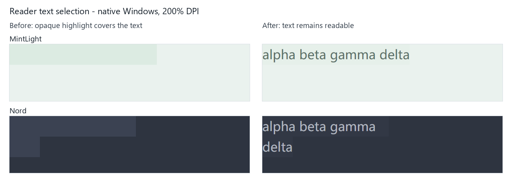

# Native Math Rendering Test

这是一份给 Nebula Markdown 阅读器使用的数学渲染截图样例。本文只把成对的 `$...$` 和 `$$...$$` 识别为数学公式；裸露 TeX 命令仍然按普通 Markdown 文本显示。

## 正文选区可读性

回答阅读器与 Markdown 文本组件的选区绘制在文字上方。之前主题适配直接复用
列表选中背景：在 MintLight、Nord 等主题中，这个背景不透明，会遮住已经绘制的
字形。主题适配现在保留原色相，并遵循 gpui-component 对文字选区的 0.3 不透明度（alpha）
上限；更透明的主题保持原值。列表、侧栏的实色选中背景不受影响。

验证时，在 MintLight 和 Nord 中分别拖选下面这句正文，检查选中后文字仍可读、
布局不移动，复制得到的内容与所选文字一致；再缩窄窗口检查换行后的选择。

alpha beta gamma delta

自动回归覆盖全部内置主题的选区颜色和透明度、主题 token 同步，以及真实
TextView 控件在深浅主题与宽窄布局下的鼠标拖选、键盘复制。另在 Windows 200%
缩放下对 MintLight 宽布局、Nord 窄布局做了原生窗口对照，修复前后的截图仅裁剪
标题栏与留白，未重绘内容：



原生预览可通过默认忽略的 `native_reader_selection_preview` 测试复核：先将
`PEBREL_SELECTION_QA_DIR` 设置为新的绝对输出目录，按需设置
`PEBREL_SELECTION_QA_THEME`（默认 MintLight）和 `PEBREL_SELECTION_QA_WIDTH`
（默认 480），然后运行：

```text
cargo test --locked -p nebula --bin pebrel --features gpui-test-support native_reader_selection_preview -- --ignored --nocapture --test-threads=1
```

测试只对自己的原生 TextView 窗口分发选择事件，不启动终端或 AI 会话、不改系统
剪贴板。输出目录出现 `ready.json` 后可截图，写入 `capture-complete` 文件即可
结束预览；没有信号时最多等待约一分钟后退出。

虚拟窗口测试不等同于完整产品验收；Linux/macOS 原生窗口、其他缩放和真实答案
内容仍需对应平台检查。本修复不改变
LaTeX 解析、公式选择时的源码回退、剪贴板格式或终端网格的配色；没有新增依赖
或逐帧计算，颜色只在主题应用时适配。

## 1. 行内公式

行内公式应该和中文、英文正常混排：圆的面积是 $S=\pi r^2$，勾股定理是 $a^2+b^2=c^2$，欧拉恒等式是 $e^{i\pi}+1=0$。这里再放一个带上下标的表达式 $x_{i+1}^2+y_{j-1}^2$，检查基线、间距和换行。

## 2. 希腊字母与常用运算符

$$
\alpha+\beta+\gamma+\Delta+\Theta+\Lambda+\Omega
$$

$$
\pm\quad \mp\quad \times\quad \div\quad \cdot\quad \ast\quad \circ\quad \bullet\quad \oplus\quad \otimes
$$

## 3. 关系符号与集合

$$
x\ne y,\quad x\neq y,\quad x\approx y,\quad x\equiv y,\quad x\leq y,\quad x\geq y
$$

$$
A\subseteq B,\quad B\supseteq A,\quad A\cap B,\quad A\cup B,\quad x\in A,\quad x\notin B,\quad \varnothing
$$

## 4. 箭头

$$
a\to b\quad b\leftarrow a\quad A\leftrightarrow B\quad P\Rightarrow Q\quad P\Leftrightarrow Q
$$

下面这行中的 `->` 是普通 Markdown 文本，不应该被识别成数学：`source -> target`。

## 5. 分式、根式与二项式

$$
\frac{1}{2}+\frac{x+1}{x-1}=\frac{x^2+1}{x^2-1}
$$

$$
\sqrt{x^2+y^2}\quad \sqrt[3]{x^3+y^3}\quad \sqrt{\frac{a+b}{c+d}}\quad \binom{n}{k}
$$

## 6. 上下标与重音

$$
\sum_{k=1}^{n}k^2,\quad \prod_{i=1}^{n}x_i,\quad a_0+a_1x+a_2x^2+\cdots+a_nx^n
$$

$$
\hat{x}
$$

$$
\vec{v}
$$

$$
\dot{x}\quad \ddot{x}
$$

## 7. 极限、导数与积分

$$
\lim_{x\to 0}\frac{\sin x}{x}=1
$$

$$
\frac{\mathrm{d}}{\mathrm{d}x}\left(x^3+2x\right)=3x^2+2,\quad
\frac{\partial^2 f}{\partial x\partial y}
$$

$$
\int_{0}^{1}x^2\,\mathrm{d}x=\frac{1}{3},\quad
\iint_{D}(x+y)\,\mathrm{d}x\,\mathrm{d}y,\quad
\oint_C\vec{F}\cdot\mathrm{d}\vec{r}
$$

## 8. 伸缩括号与绝对值

$$
\left(\frac{a}{b}\right),\quad
\left[\sum_{i=1}^{n}x_i\right],\quad
\left\{x\in\mathbb{R}\mid x>0\right\},\quad
\left\lvert x-1\right\rvert<\varepsilon
$$

## 9. 矩阵

$$
\begin{matrix}
a & b \\
c & d
\end{matrix}
\qquad
\begin{pmatrix}
1 & 0 & 0 \\
0 & 1 & 0 \\
0 & 0 & 1
\end{pmatrix}
$$

$$
\begin{bmatrix}
1 & 2 & 3 \\
4 & 5 & 6
\end{bmatrix}
\qquad
\begin{vmatrix}
a & b \\
c & d
\end{vmatrix}=ad-bc
$$

## 10. 分段函数与多行公式

$$
f(x)=\begin{cases}
x^2, & x\ge 0 \\
-x^2, & x<0
\end{cases}
$$

$$
\begin{aligned}
(a+b)^2 &= a^2+2ab+b^2 \\
(a-b)^2 &= a^2-2ab+b^2
\end{aligned}
$$

## 11. 逻辑、偏导与向量分析

$$
\forall\varepsilon>0,\quad \exists\delta>0,\quad
0<\lvert x-a\rvert<\delta\Rightarrow\lvert f(x)-f(a)\rvert<\varepsilon
$$

$$
\nabla\cdot\vec{E}=\frac{\rho}{\varepsilon_0},\quad
\nabla\times\vec{B}=\mu_0\vec{J}+\mu_0\varepsilon_0\frac{\partial\vec{E}}{\partial t}
$$

## 12. 长公式换行与收缩

下面的块级公式用于检查过宽公式是否会自动收缩到阅读列内，而不是越过右边界：

$$
\frac{\displaystyle\sum_{i=1}^{n}\left(\alpha_i x_i+\beta_i y_i\right)}{\sqrt{\displaystyle\prod_{j=1}^{m}\left(1+z_j^2\right)}}
\leq
\left\lvert\int_{0}^{1}\frac{e^{t^2}}{1+t^2}\,\mathrm{d}t\right\rvert+\left\lvert\oint_C\vec{F}\cdot\mathrm{d}\vec{r}\right\rvert
$$

## 13. 空行与 Unicode 说明文字

下面的公式中故意保留空行和中文说明，检查块级 `$$` 的跨行处理：

$$
\sin(a+b)=\sin a\cos b+\cos a\sin b

这里是公式内部的中文说明：和角公式。

\cos(a+b)=\cos a\cos b-\sin a\sin b
$$

## 14. 边界对照

下面这些内容不应该生成数学字形，因为没有使用 `$` 或 `$$` 围栏：

```text
\lim_{x \to 0} \frac{\sin x}{x}
\sqrt{x^2+y^2}
\frac{1}{2}
```

最后的明确行内公式应该生成数学字形：$\lim_{x\to 0}\frac{\sin x}{x}=1$。

## 15. 用户报告的七组科研公式

每组先保留 `katex` 源码块，再用相同源码实际渲染。源码块只用于比对，公式由 `$` / `$$` 触发。测试直接读取本文件，不另抄公式。

### 欧拉恒等式

```katex
e^{i\pi}+1=0
```

$$
e^{i\pi}+1=0
$$

### 高斯积分

```katex
\int_{-\infty}^{+\infty} e^{-x^2}\,dx=\sqrt{\pi}
```

$$
\int_{-\infty}^{+\infty} e^{-x^2}\,dx=\sqrt{\pi}
$$

### 傅里叶变换

```katex
\widehat{f}(\xi)
=
\int_{-\infty}^{+\infty}
f(x)e^{-2\pi i x\xi}\,dx
```

$$
\widehat{f}(\xi)
=
\int_{-\infty}^{+\infty}
f(x)e^{-2\pi i x\xi}\,dx
$$

### Transformer 注意力机制

```katex
\operatorname{Attention}(Q,K,V)
=
\operatorname{softmax}\left(
\frac{QK^{\mathsf T}}{\sqrt{d_k}}
\right)V
```

$$
\operatorname{Attention}(Q,K,V)
=
\operatorname{softmax}\left(
\frac{QK^{\mathsf T}}{\sqrt{d_k}}
\right)V
$$

### 分段函数

```katex
\phi(x)=
\begin{cases}
x, & x\ge 0,\\
\alpha(e^x-1), & x<0.
\end{cases}
```

$$
\phi(x)=
\begin{cases}
x, & x\ge 0,\\
\alpha(e^x-1), & x<0.
\end{cases}
$$

### 矩阵

```katex
A=
\begin{pmatrix}
a_{11} & a_{12} & \cdots & a_{1n}\\
a_{21} & a_{22} & \cdots & a_{2n}\\
\vdots & \vdots & \ddots & \vdots\\
a_{m1} & a_{m2} & \cdots & a_{mn}
\end{pmatrix}
```

$$
A=
\begin{pmatrix}
a_{11} & a_{12} & \cdots & a_{1n}\\
a_{21} & a_{22} & \cdots & a_{2n}\\
\vdots & \vdots & \ddots & \vdots\\
a_{m1} & a_{m2} & \cdots & a_{mn}
\end{pmatrix}
$$

### 多行推导

```katex
\begin{aligned}
(a+b)^3
&=(a+b)(a+b)^2\\
&=(a+b)(a^2+2ab+b^2)\\
&=a^3+3a^2b+3ab^2+b^3
\end{aligned}
```

$$
\begin{aligned}
(a+b)^3
&=(a+b)(a+b)^2\\
&=(a+b)(a^2+2ab+b^2)\\
&=a^3+3a^2b+3ab^2+b^3
\end{aligned}
$$

## 16. 原始输出的异常对照

前三个样例仍是可以排版的 TeX，但保留用户报告中的逗号和缺失等号，用于核对数学语义与原文保存。不能自动补出缺失的等号，也不能把逗号猜成 TeX 间距；测试只应确认源文本未被改写。后三个行末单反斜杠样例才是损坏输入，需要源码回退。

### 高斯积分：逗号仍然是逗号

<!-- pebrel-test: preserve-source -->
$$
\int_{-\infty}^{+\infty} e^{-x^2},dx=\sqrt{\pi}
$$

### 傅里叶变换：原文缺少等号

<!-- pebrel-test: preserve-source -->
$$
\widehat{f}(\xi)

\int_{-\infty}^{+\infty}
f(x)e^{-2\pi i x\xi},dx
$$

### 注意力公式：原文缺少等号

<!-- pebrel-test: preserve-source -->
$$
\operatorname{Attention}(Q,K,V)

\operatorname{softmax}\left(
\frac{QK^{\mathsf T}}{\sqrt{d_k}}
\right)V
$$

### 行结束反斜杠损坏：分段函数

<!-- pebrel-test: source-fallback -->
$$
\phi(x)=
\begin{cases}
x, & x\ge 0,\
\alpha(e^x-1), & x<0.
\end{cases}
$$

### 行结束反斜杠损坏：矩阵

<!-- pebrel-test: source-fallback -->
$$
A=
\begin{pmatrix}
a_{11} & a_{12} & \cdots & a_{1n}\
a_{21} & a_{22} & \cdots & a_{2n}\
\vdots & \vdots & \ddots & \vdots\
a_{m1} & a_{m2} & \cdots & a_{mn}
\end{pmatrix}
$$

### 行结束反斜杠损坏：多行推导

<!-- pebrel-test: source-fallback -->
$$
\begin{aligned}
(a+b)^3
&=(a+b)(a+b)^2\
&=(a+b)(a^2+2ab+b^2)\
&=a^3+3a^2b+3ab^2+b^3
\end{aligned}
$$

## 17. 滚动、选区和缩放回归

在本文件顶部与末尾之间往返滚动，再在公式附近拖选中文、英文和源码。窗口从宽列缩到窄列后恢复，检查分母、根号、矩阵括号、相邻文字和选区。Ctrl+C 的结果应保持源文本语义。输入法正在组合、终端光标所在行和 VI 模式不能被图片覆盖。

下面的不同公式用于扰动布局缓存；编号是测试参数，不是新增数学结论。

### 滚动样例 01

第 1 段：公式前的中文与英文 baseline alignment，检查窗口缩放后的段落连续性。

$$
f_{1}(x)=\frac{x^2+1}{\sqrt{1+x^2}}+\sum_{k=1}^{1}k
$$

公式后的说明应留在原段落中，重复拖选和滚动不能复制出渲染器内部文本。

### 滚动样例 02

第 2 段：公式前的中文与英文 baseline alignment，检查窗口缩放后的段落连续性。

$$
f_{2}(x)=\frac{x^2+2}{\sqrt{1+x^2}}+\sum_{k=1}^{2}k
$$

公式后的说明应留在原段落中，重复拖选和滚动不能复制出渲染器内部文本。

### 滚动样例 03

第 3 段：公式前的中文与英文 baseline alignment，检查窗口缩放后的段落连续性。

$$
f_{3}(x)=\frac{x^2+3}{\sqrt{1+x^2}}+\sum_{k=1}^{3}k
$$

公式后的说明应留在原段落中，重复拖选和滚动不能复制出渲染器内部文本。

### 滚动样例 04

第 4 段：公式前的中文与英文 baseline alignment，检查窗口缩放后的段落连续性。

$$
f_{4}(x)=\frac{x^2+4}{\sqrt{1+x^2}}+\sum_{k=1}^{4}k
$$

公式后的说明应留在原段落中，重复拖选和滚动不能复制出渲染器内部文本。

### 滚动样例 05

第 5 段：公式前的中文与英文 baseline alignment，检查窗口缩放后的段落连续性。

$$
f_{5}(x)=\frac{x^2+5}{\sqrt{1+x^2}}+\sum_{k=1}^{5}k
$$

公式后的说明应留在原段落中，重复拖选和滚动不能复制出渲染器内部文本。

### 滚动样例 06

第 6 段：公式前的中文与英文 baseline alignment，检查窗口缩放后的段落连续性。

$$
f_{6}(x)=\frac{x^2+6}{\sqrt{1+x^2}}+\sum_{k=1}^{6}k
$$

公式后的说明应留在原段落中，重复拖选和滚动不能复制出渲染器内部文本。

### 滚动样例 07

第 7 段：公式前的中文与英文 baseline alignment，检查窗口缩放后的段落连续性。

$$
f_{7}(x)=\frac{x^2+7}{\sqrt{1+x^2}}+\sum_{k=1}^{7}k
$$

公式后的说明应留在原段落中，重复拖选和滚动不能复制出渲染器内部文本。

### 滚动样例 08

第 8 段：公式前的中文与英文 baseline alignment，检查窗口缩放后的段落连续性。

$$
f_{8}(x)=\frac{x^2+8}{\sqrt{1+x^2}}+\sum_{k=1}^{8}k
$$

公式后的说明应留在原段落中，重复拖选和滚动不能复制出渲染器内部文本。

### 滚动样例 09

第 9 段：公式前的中文与英文 baseline alignment，检查窗口缩放后的段落连续性。

$$
f_{9}(x)=\frac{x^2+9}{\sqrt{1+x^2}}+\sum_{k=1}^{9}k
$$

公式后的说明应留在原段落中，重复拖选和滚动不能复制出渲染器内部文本。

### 滚动样例 10

第 10 段：公式前的中文与英文 baseline alignment，检查窗口缩放后的段落连续性。

$$
f_{10}(x)=\frac{x^2+10}{\sqrt{1+x^2}}+\sum_{k=1}^{10}k
$$

公式后的说明应留在原段落中，重复拖选和滚动不能复制出渲染器内部文本。

### 滚动样例 11

第 11 段：公式前的中文与英文 baseline alignment，检查窗口缩放后的段落连续性。

$$
f_{11}(x)=\frac{x^2+11}{\sqrt{1+x^2}}+\sum_{k=1}^{11}k
$$

公式后的说明应留在原段落中，重复拖选和滚动不能复制出渲染器内部文本。

### 滚动样例 12

第 12 段：公式前的中文与英文 baseline alignment，检查窗口缩放后的段落连续性。

$$
f_{12}(x)=\frac{x^2+12}{\sqrt{1+x^2}}+\sum_{k=1}^{12}k
$$

公式后的说明应留在原段落中，重复拖选和滚动不能复制出渲染器内部文本。

### 滚动样例 13

第 13 段：公式前的中文与英文 baseline alignment，检查窗口缩放后的段落连续性。

$$
f_{13}(x)=\frac{x^2+13}{\sqrt{1+x^2}}+\sum_{k=1}^{13}k
$$

公式后的说明应留在原段落中，重复拖选和滚动不能复制出渲染器内部文本。

### 滚动样例 14

第 14 段：公式前的中文与英文 baseline alignment，检查窗口缩放后的段落连续性。

$$
f_{14}(x)=\frac{x^2+14}{\sqrt{1+x^2}}+\sum_{k=1}^{14}k
$$

公式后的说明应留在原段落中，重复拖选和滚动不能复制出渲染器内部文本。

### 滚动样例 15

第 15 段：公式前的中文与英文 baseline alignment，检查窗口缩放后的段落连续性。

$$
f_{15}(x)=\frac{x^2+15}{\sqrt{1+x^2}}+\sum_{k=1}^{15}k
$$

公式后的说明应留在原段落中，重复拖选和滚动不能复制出渲染器内部文本。

### 滚动样例 16

第 16 段：公式前的中文与英文 baseline alignment，检查窗口缩放后的段落连续性。

$$
f_{16}(x)=\frac{x^2+16}{\sqrt{1+x^2}}+\sum_{k=1}^{16}k
$$

公式后的说明应留在原段落中，重复拖选和滚动不能复制出渲染器内部文本。

### 滚动样例 17

第 17 段：公式前的中文与英文 baseline alignment，检查窗口缩放后的段落连续性。

$$
f_{17}(x)=\frac{x^2+17}{\sqrt{1+x^2}}+\sum_{k=1}^{17}k
$$

公式后的说明应留在原段落中，重复拖选和滚动不能复制出渲染器内部文本。

### 滚动样例 18

第 18 段：公式前的中文与英文 baseline alignment，检查窗口缩放后的段落连续性。

$$
f_{18}(x)=\frac{x^2+18}{\sqrt{1+x^2}}+\sum_{k=1}^{18}k
$$

公式后的说明应留在原段落中，重复拖选和滚动不能复制出渲染器内部文本。

### 滚动样例 19

第 19 段：公式前的中文与英文 baseline alignment，检查窗口缩放后的段落连续性。

$$
f_{19}(x)=\frac{x^2+19}{\sqrt{1+x^2}}+\sum_{k=1}^{19}k
$$

公式后的说明应留在原段落中，重复拖选和滚动不能复制出渲染器内部文本。

### 滚动样例 20

第 20 段：公式前的中文与英文 baseline alignment，检查窗口缩放后的段落连续性。

$$
f_{20}(x)=\frac{x^2+20}{\sqrt{1+x^2}}+\sum_{k=1}^{20}k
$$

公式后的说明应留在原段落中，重复拖选和滚动不能复制出渲染器内部文本。

### 滚动样例 21

第 21 段：公式前的中文与英文 baseline alignment，检查窗口缩放后的段落连续性。

$$
f_{21}(x)=\frac{x^2+21}{\sqrt{1+x^2}}+\sum_{k=1}^{21}k
$$

公式后的说明应留在原段落中，重复拖选和滚动不能复制出渲染器内部文本。

### 滚动样例 22

第 22 段：公式前的中文与英文 baseline alignment，检查窗口缩放后的段落连续性。

$$
f_{22}(x)=\frac{x^2+22}{\sqrt{1+x^2}}+\sum_{k=1}^{22}k
$$

公式后的说明应留在原段落中，重复拖选和滚动不能复制出渲染器内部文本。

### 滚动样例 23

第 23 段：公式前的中文与英文 baseline alignment，检查窗口缩放后的段落连续性。

$$
f_{23}(x)=\frac{x^2+23}{\sqrt{1+x^2}}+\sum_{k=1}^{23}k
$$

公式后的说明应留在原段落中，重复拖选和滚动不能复制出渲染器内部文本。

### 滚动样例 24

第 24 段：公式前的中文与英文 baseline alignment，检查窗口缩放后的段落连续性。

$$
f_{24}(x)=\frac{x^2+24}{\sqrt{1+x^2}}+\sum_{k=1}^{24}k
$$

公式后的说明应留在原段落中，重复拖选和滚动不能复制出渲染器内部文本。

### 滚动样例 25

第 25 段：公式前的中文与英文 baseline alignment，检查窗口缩放后的段落连续性。

$$
f_{25}(x)=\frac{x^2+25}{\sqrt{1+x^2}}+\sum_{k=1}^{25}k
$$

公式后的说明应留在原段落中，重复拖选和滚动不能复制出渲染器内部文本。

### 滚动样例 26

第 26 段：公式前的中文与英文 baseline alignment，检查窗口缩放后的段落连续性。

$$
f_{26}(x)=\frac{x^2+26}{\sqrt{1+x^2}}+\sum_{k=1}^{26}k
$$

公式后的说明应留在原段落中，重复拖选和滚动不能复制出渲染器内部文本。

### 滚动样例 27

第 27 段：公式前的中文与英文 baseline alignment，检查窗口缩放后的段落连续性。

$$
f_{27}(x)=\frac{x^2+27}{\sqrt{1+x^2}}+\sum_{k=1}^{27}k
$$

公式后的说明应留在原段落中，重复拖选和滚动不能复制出渲染器内部文本。

### 滚动样例 28

第 28 段：公式前的中文与英文 baseline alignment，检查窗口缩放后的段落连续性。

$$
f_{28}(x)=\frac{x^2+28}{\sqrt{1+x^2}}+\sum_{k=1}^{28}k
$$

公式后的说明应留在原段落中，重复拖选和滚动不能复制出渲染器内部文本。

### 滚动样例 29

第 29 段：公式前的中文与英文 baseline alignment，检查窗口缩放后的段落连续性。

$$
f_{29}(x)=\frac{x^2+29}{\sqrt{1+x^2}}+\sum_{k=1}^{29}k
$$

公式后的说明应留在原段落中，重复拖选和滚动不能复制出渲染器内部文本。

### 滚动样例 30

第 30 段：公式前的中文与英文 baseline alignment，检查窗口缩放后的段落连续性。

$$
f_{30}(x)=\frac{x^2+30}{\sqrt{1+x^2}}+\sum_{k=1}^{30}k
$$

公式后的说明应留在原段落中，重复拖选和滚动不能复制出渲染器内部文本。

### 滚动样例 31

第 31 段：公式前的中文与英文 baseline alignment，检查窗口缩放后的段落连续性。

$$
f_{31}(x)=\frac{x^2+31}{\sqrt{1+x^2}}+\sum_{k=1}^{31}k
$$

公式后的说明应留在原段落中，重复拖选和滚动不能复制出渲染器内部文本。

### 滚动样例 32

第 32 段：公式前的中文与英文 baseline alignment，检查窗口缩放后的段落连续性。

$$
f_{32}(x)=\frac{x^2+32}{\sqrt{1+x^2}}+\sum_{k=1}^{32}k
$$

公式后的说明应留在原段落中，重复拖选和滚动不能复制出渲染器内部文本。

### 滚动样例 33

第 33 段：公式前的中文与英文 baseline alignment，检查窗口缩放后的段落连续性。

$$
f_{33}(x)=\frac{x^2+33}{\sqrt{1+x^2}}+\sum_{k=1}^{33}k
$$

公式后的说明应留在原段落中，重复拖选和滚动不能复制出渲染器内部文本。

### 滚动样例 34

第 34 段：公式前的中文与英文 baseline alignment，检查窗口缩放后的段落连续性。

$$
f_{34}(x)=\frac{x^2+34}{\sqrt{1+x^2}}+\sum_{k=1}^{34}k
$$

公式后的说明应留在原段落中，重复拖选和滚动不能复制出渲染器内部文本。

### 滚动样例 35

第 35 段：公式前的中文与英文 baseline alignment，检查窗口缩放后的段落连续性。

$$
f_{35}(x)=\frac{x^2+35}{\sqrt{1+x^2}}+\sum_{k=1}^{35}k
$$

公式后的说明应留在原段落中，重复拖选和滚动不能复制出渲染器内部文本。

### 滚动样例 36

第 36 段：公式前的中文与英文 baseline alignment，检查窗口缩放后的段落连续性。

$$
f_{36}(x)=\frac{x^2+36}{\sqrt{1+x^2}}+\sum_{k=1}^{36}k
$$

公式后的说明应留在原段落中，重复拖选和滚动不能复制出渲染器内部文本。

### 滚动样例 37

第 37 段：公式前的中文与英文 baseline alignment，检查窗口缩放后的段落连续性。

$$
f_{37}(x)=\frac{x^2+37}{\sqrt{1+x^2}}+\sum_{k=1}^{37}k
$$

公式后的说明应留在原段落中，重复拖选和滚动不能复制出渲染器内部文本。

### 滚动样例 38

第 38 段：公式前的中文与英文 baseline alignment，检查窗口缩放后的段落连续性。

$$
f_{38}(x)=\frac{x^2+38}{\sqrt{1+x^2}}+\sum_{k=1}^{38}k
$$

公式后的说明应留在原段落中，重复拖选和滚动不能复制出渲染器内部文本。

### 滚动样例 39

第 39 段：公式前的中文与英文 baseline alignment，检查窗口缩放后的段落连续性。

$$
f_{39}(x)=\frac{x^2+39}{\sqrt{1+x^2}}+\sum_{k=1}^{39}k
$$

公式后的说明应留在原段落中，重复拖选和滚动不能复制出渲染器内部文本。

### 滚动样例 40

第 40 段：公式前的中文与英文 baseline alignment，检查窗口缩放后的段落连续性。

$$
f_{40}(x)=\frac{x^2+40}{\sqrt{1+x^2}}+\sum_{k=1}^{40}k
$$

公式后的说明应留在原段落中，重复拖选和滚动不能复制出渲染器内部文本。

### 滚动样例 41

第 41 段：公式前的中文与英文 baseline alignment，检查窗口缩放后的段落连续性。

$$
f_{41}(x)=\frac{x^2+41}{\sqrt{1+x^2}}+\sum_{k=1}^{41}k
$$

公式后的说明应留在原段落中，重复拖选和滚动不能复制出渲染器内部文本。

### 滚动样例 42

第 42 段：公式前的中文与英文 baseline alignment，检查窗口缩放后的段落连续性。

$$
f_{42}(x)=\frac{x^2+42}{\sqrt{1+x^2}}+\sum_{k=1}^{42}k
$$

公式后的说明应留在原段落中，重复拖选和滚动不能复制出渲染器内部文本。

### 滚动样例 43

第 43 段：公式前的中文与英文 baseline alignment，检查窗口缩放后的段落连续性。

$$
f_{43}(x)=\frac{x^2+43}{\sqrt{1+x^2}}+\sum_{k=1}^{43}k
$$

公式后的说明应留在原段落中，重复拖选和滚动不能复制出渲染器内部文本。

### 滚动样例 44

第 44 段：公式前的中文与英文 baseline alignment，检查窗口缩放后的段落连续性。

$$
f_{44}(x)=\frac{x^2+44}{\sqrt{1+x^2}}+\sum_{k=1}^{44}k
$$

公式后的说明应留在原段落中，重复拖选和滚动不能复制出渲染器内部文本。

### 滚动样例 45

第 45 段：公式前的中文与英文 baseline alignment，检查窗口缩放后的段落连续性。

$$
f_{45}(x)=\frac{x^2+45}{\sqrt{1+x^2}}+\sum_{k=1}^{45}k
$$

公式后的说明应留在原段落中，重复拖选和滚动不能复制出渲染器内部文本。

### 滚动样例 46

第 46 段：公式前的中文与英文 baseline alignment，检查窗口缩放后的段落连续性。

$$
f_{46}(x)=\frac{x^2+46}{\sqrt{1+x^2}}+\sum_{k=1}^{46}k
$$

公式后的说明应留在原段落中，重复拖选和滚动不能复制出渲染器内部文本。

### 滚动样例 47

第 47 段：公式前的中文与英文 baseline alignment，检查窗口缩放后的段落连续性。

$$
f_{47}(x)=\frac{x^2+47}{\sqrt{1+x^2}}+\sum_{k=1}^{47}k
$$

公式后的说明应留在原段落中，重复拖选和滚动不能复制出渲染器内部文本。

### 滚动样例 48

第 48 段：公式前的中文与英文 baseline alignment，检查窗口缩放后的段落连续性。

$$
f_{48}(x)=\frac{x^2+48}{\sqrt{1+x^2}}+\sum_{k=1}^{48}k
$$

公式后的说明应留在原段落中，重复拖选和滚动不能复制出渲染器内部文本。

## 18. 重音与伸缩分隔符

行内中文、英文和重音公式应保持同一条基线：复数共轭写作 $\overline{z}$，向量写作 $\vec{v}$，观测量写作 $\widehat{y}$。

$$
\hat{x}\quad \bar{x}\quad \tilde{x}\quad \vec{v}\quad
\dot{x}\quad \ddot{x}\quad \widehat{AB}\quad
\widetilde{f+g}\quad \overline{z}
$$

$$
\begin{gathered}
\left(\frac{a}{b}\right)\quad
\left[\sum_{i=1}^{n}x_i\right]\quad
\left\{x\in\mathbb{R}\mid x>0\right\}\\
\left\langle u,v\right\rangle\quad
\left\lvert x-1\right\rvert\quad
\left\Vert A\right\Vert\quad
\left\lfloor y\right\rfloor\quad
\left\lceil y\right\rceil
\end{gathered}
$$

$$
\big(x+y\big)\quad
\Big[x\Big]\quad
\bigg\{x\bigg\}\quad
\Bigg\langle x\Bigg\rangle\quad
\left.\frac{\mathrm{d}f}{\mathrm{d}x}\right|_{x=0}
$$

## 19. 积分、大运算符与上下限

上限和下限同时存在时，积分号、求和号和乘积号的脚标应随公式缩放；积分后的单位写在同一行。

$$
\int_{0}^{1}x^2\,\mathrm{d}x=\frac{1}{3},\quad
\iint_{D}f(x,y)\,\mathrm{d}A,\quad
\iiint_{V}g(x,y,z)\,\mathrm{d}V,\quad
\oint_{\partial\Omega}\vec{F}\cdot\mathrm{d}\vec{r}
$$

$$
\sum_{k=0}^{n}k^2,\quad
\prod_{j=1}^{m}a_j,\quad
\bigcup_{i=1}^{n}A_i,\quad
\bigcap_{i=1}^{n}B_i,\quad
\sum_{i=1}^{n}C_i
$$

$$
\lim_{x\to 0}\frac{\sin x}{x}=1,\quad
\limsup_{n\to\infty}a_n,\quad
\sup_{x\in D}f(x),\quad
\inf_{x\in D}f(x)
$$

## 20. 希腊字母、集合与逻辑

$$
\alpha\ \beta\ \gamma\ \delta\ \epsilon\ \varepsilon\ \zeta\ \eta\ \theta\ \vartheta\ \iota\ \kappa\ \lambda\ \mu\ \nu\ \xi\ \pi\ \varpi\ \rho\ \varrho\ \sigma\ \varsigma\ \tau\ \upsilon\ \phi\ \varphi\ \chi\ \psi\ \omega
$$

$$
\mathbb{N}\subset\mathbb{Z}\subset\mathbb{Q}\subset\mathbb{R}\subset\mathbb{C},\quad
\mathbb{R}\supset\mathbb{Q},\quad
A\cup B,\quad
\lvert A\cup B\rvert=\lvert A\rvert+\lvert B\rvert-\lvert A\cap B\rvert
$$

$$
\forall x\in X,\ \exists y\in Y:\ P(x,y),\quad
\neg(P\land Q)\Leftrightarrow(\neg P\lor\neg Q),\quad
P\Rightarrow Q,\quad Q\Leftrightarrow P
$$

## 21. 矩阵环境族

$$
\begin{Bmatrix}
a & b\\
c & d
\end{Bmatrix}
\qquad
\begin{Vmatrix}
a & b\\
c & d
\end{Vmatrix}
$$

$$
\begin{smallmatrix}
1 & 2 & 3\\
4 & 5 & 6
\end{smallmatrix}
\qquad
\begin{array}{lcr}
\text{左对齐} & \text{居中} & \text{右对齐}\\
a & b & c\\
d & e & f
\end{array}
$$

$$
\begin{pmatrix}
1 & 0\\
0 & 1
\end{pmatrix}
\begin{bmatrix}
1 & 2\\
3 & 4
\end{bmatrix}
\begin{Bmatrix}
1 & 2\\
3 & 4
\end{Bmatrix}
$$

## 22. 嵌套分式与根式

$$
\frac{1+\dfrac{1}{1+\tfrac{1}{x}}}
{\sqrt{1+\frac{a^2}{b^2}}}
\quad
\frac{\sqrt{b^2+a^2}}{\sqrt{b^2}}
$$

$$
\sqrt{\frac{1+\frac{1}{n}}{1-\frac{1}{n}}}\quad
\sqrt[3]{\frac{x^3+y^3}{x+y}}\quad
\sqrt[\alpha]{\frac{\dfrac{p}{q}}{\sqrt{r+s}}}
$$

$$
\left(
\frac{\dfrac{\sqrt{x+1}}{y-1}}
{\dfrac{a+b}{c+d}}
\right)^{\!2}
\quad
\frac{\displaystyle\sum_{i=1}^{n}\frac{x_i}{1+x_i^2}}
{\displaystyle\sqrt{\prod_{j=1}^{m}(1+z_j^2)}}
$$

## 23. 对齐与多行推导环境

$$
\begin{gathered}
u+v=w\\
w+t=s\\
s-r=q
\end{gathered}
$$

$$
\begin{split}
\sin(a+b)
&=\sin a\cos b+\cos a\sin b\\
\cos(a+b)
&=\cos a\cos b-\sin a\sin b
\end{split}
$$

$$
\begin{alignedat}{2}
f(x)&=x^2+1 &\qquad g(x)&=x^2-1\\
f'(x)&=2x & g'(x)&=2x
\end{alignedat}
$$

$$
\begin{multline}
\frac{1}{2}(a+b)^2
=\frac{1}{2}a^2+ab+\frac{1}{2}b^2\\
\text{用于检查多行公式在窄列中的连续性}
\end{multline}
$$

## 24. 字体变体与样式

$$
\mathrm{d}x\quad
\mathbf{v}\quad
\mathit{X}\quad
\mathsf{N}\quad
\mathtt{code}\quad
\mathbb{R}\quad
\mathcal{L}\quad
\mathfrak{g}
$$

$$
\displaystyle\sum_{n=1}^{\infty}\frac{1}{n^2}
=\frac{\pi^2}{6},\qquad
\textstyle\sum_{n=1}^{3}n,\qquad
\scriptstyle x_i^2,\qquad
\scriptscriptstyle x_i^2
$$

$$
\operatorname{rank}(BC)\leq
\min\{\operatorname{rank}(B),\operatorname{rank}(C)\},\quad
\mathrm{e}^{\mathrm{i}\theta}=\cos\theta+\mathrm{i}\sin\theta
$$

## 25. 单位与中文混排

中文说明应可以紧邻行内公式：样品长度为 $12\,\mathrm{mm}$，速度为 $3.0\,\mathrm{m\,s^{-1}}$，温度为 $300\,\mathrm{K}$。公式前后的汉字不能被公式盒覆盖。

$$
m=2.5\,\mathrm{kg},\quad
E=mc^2,\quad
p=1.01\,\mathrm{MPa},\quad
c=299\,792\,458\,\mathrm{m\,s^{-1}}
$$

$$
\rho=\frac{m}{V}=1.00\,\mathrm{g\,cm^{-3}},\quad
\lambda=532\,\mathrm{nm},\quad
\nu=6.0\times10^{14}\,\mathrm{Hz},\quad
\Delta T=25\,\mathrm{K}
$$

带中文的自然段也应保持数学源文本可复制：在 $x=0$ 附近，函数 $f(x)$ 的一阶导数满足 $\frac{\mathrm{d}f}{\mathrm{d}x}=0$。

## 26. 可降级装饰

boxed 和 tag 只要求数学内容仍可读；边框或编号位置可以由渲染器降级处理。

$$
\boxed{E=mc^2}\tag{1}
$$

$$
\boxed{\frac{a+b}{c+d}}\tag*{附录}
$$

## 27. 不支持宏与坏输入的源码回退

以下块故意使用当前引擎不支持的化学式、物理量和单位宏。回退时保留原始数学源码，不应把这些宏猜译成另一种公式。

<!-- pebrel-test: source-fallback -->
$$
\ce{H2O + CO2 -> H2CO3}
$$

<!-- pebrel-test: source-fallback -->
$$
\pu{9.81\ m/s^2}
$$

<!-- pebrel-test: source-fallback -->
$$
\SI{9.81}{\meter\per\second\squared}
$$

以下块有意缺少右花括号，用于确认坏输入会回退到源码；不能补写缺失字符后再声称公式成功。

<!-- pebrel-test: source-fallback -->
$$
\frac{a+b}{c+d
$$
